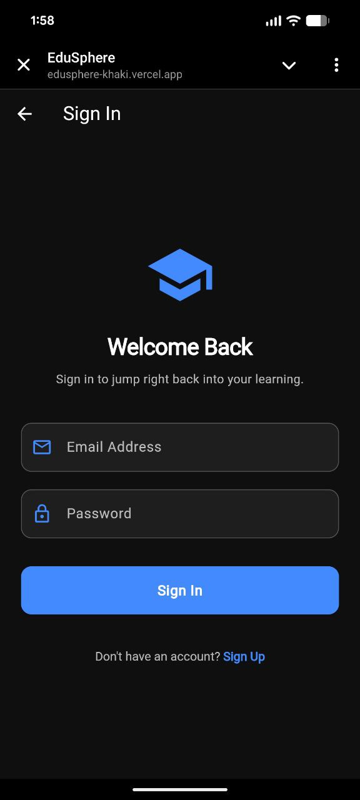

# EduSphere

EduSphere is a Flutter-based web application designed to provide students with a **distraction-free platform for educational content**.
The app filters and presents curated learning material while also providing an **AI-powered chatbot assistant** to help users understand concepts and navigate learning resources.

---

## Live Demo

https://edusphere-khaki.vercel.app/

---

## Features

**Curated Educational Content**
Displays learning-focused content in a clean and organized interface.

**AI Chatbot Assistant**
Built-in AI chatbot that helps users ask questions, get explanations, and assist with learning.

**Distraction-Free Learning**
Designed to reduce clutter and focus only on educational material.

**Web Deployment**
Deployed online so users can access the app from any browser.

**Fast and Responsive UI**
Built using Flutter for smooth performance across devices.

---

## Screenshots

### Home Interface


### Login Screen



### Video Player


### AI Chatbot Interface


---

## Tech Stack

* **Flutter**
* **Dart**
* **Firebase Hosting**
* **YouTube API**
* **AI Chatbot Integration using Gemini API**

---

## Project Structure

```
edusphere
│
├── lib/            # Main Flutter application code
├── web/            # Web configuration
├── android/        # Android build files
├── ios/            # iOS build files
├── test/           # Unit tests
│
├── pubspec.yaml    # Dependencies
├── firebase.json   # Firebase hosting configuration
└── README.md
```

---

## Installation

Clone the repository:

```
git clone https://github.com/shreyanshkansara/EduSphere.git
```

Navigate into the project:

```
cd EduSphere
```

Install dependencies:

```
flutter pub get
```

Run the application:

```
flutter run
```

---

## Deployment

The application is deployed using **Firebase Hosting**.

To deploy manually:

```
flutter build web
firebase deploy
```

---

## Author

Shreyansh Kansara

GitHub: https://github.com/shreyanshkansara
LinkedIn: https://www.linkedin.com/in/shreyanshkansara/
